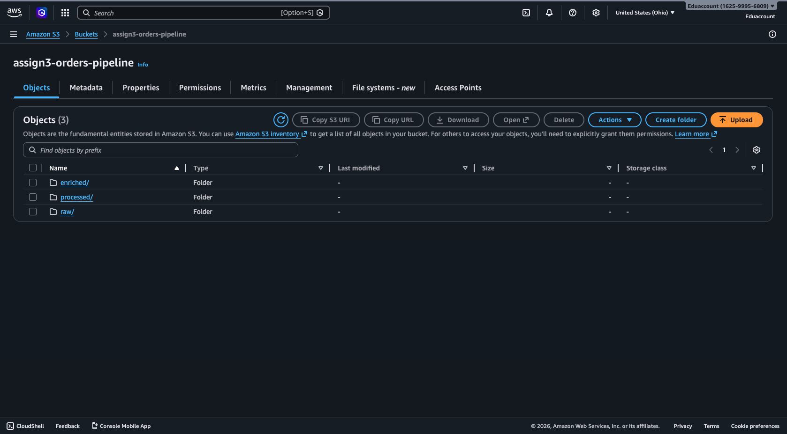
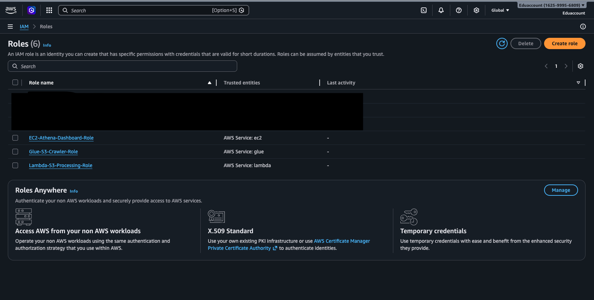
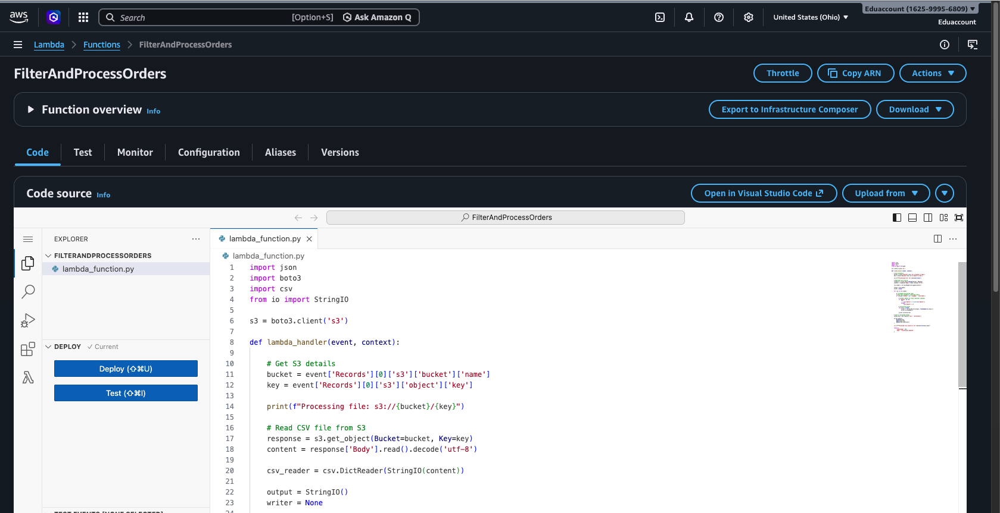
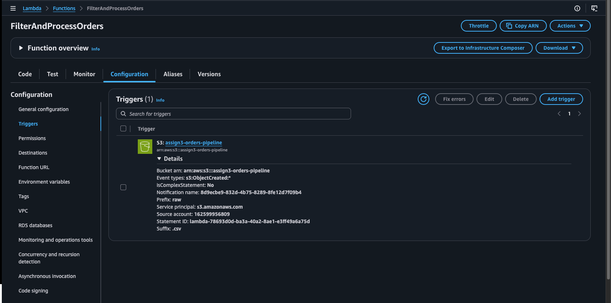
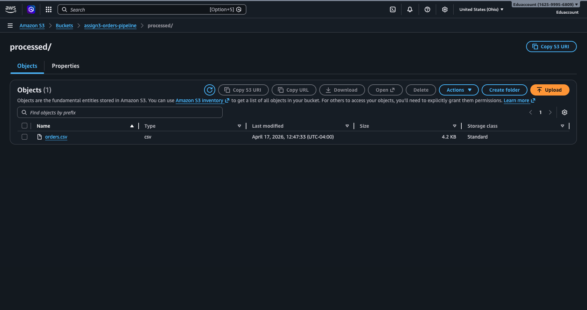
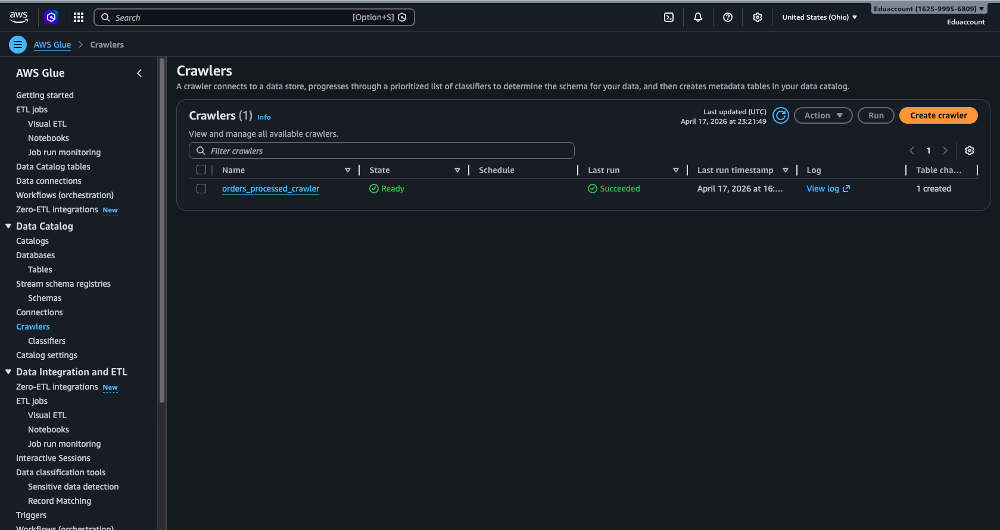
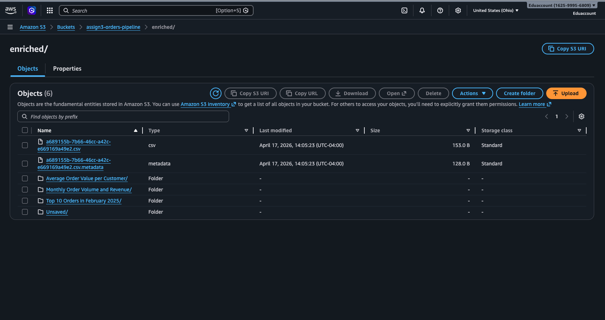

# AWS End-to-End Data Pipeline 

##  Overview

This project demonstrates an end-to-end data pipeline using AWS core services. The pipeline processes raw order data stored in Amazon S3, performs transformations using AWS Lambda, catalogs the data with AWS Glue, enables querying via Amazon Athena, and finally displays results using a Flask-based web dashboard hosted on EC2.

---

##  Architecture

S3 (raw data) → Lambda (processing) → S3 (processed) → Glue (crawler) → Athena (queries) → EC2 (dashboard)

---

##  AWS Services Used

* **Amazon S3** – Data storage (raw, processed, enriched)
* **AWS Lambda** – Serverless data transformation
* **AWS Glue** – Data catalog and crawler
* **Amazon Athena** – SQL-based data analysis
* **Amazon EC2** – Hosting Flask web application
* **AWS IAM** – Role-based access control
* **Amazon CloudWatch** – Logging and monitoring

---

##  Project Structure

```text
aws-end-to-end-data-pipeline/
│
├── lambda/
│   └── lambda_function.py
│
├── ec2/
│   └── app.py
│
├── screenshots/
│   ├── 1_s3_structure.png
│   ├── 2_iam_roles.png
│   ├── 3_lambda_function.png
│   ├── 4_lambda_trigger.png
│   ├── 5_processed_data.png
│   ├── 6_glue_crawler.png
│   ├── 7_athena_output.png
│   └── 8_webpage.png
│
└── README.md
```

---

##  S3 Bucket Structure

* `raw/` – Input dataset (Orders.csv)
* `processed/` – Cleaned and filtered data
* `enriched/` – Athena query outputs

📸


---

##  IAM Roles

Three IAM roles were created to enable secure service interaction:

* Lambda-S3-Processing-Role
* Glue-S3-Crawler-Role
* EC2-Athena-Dashboard-Role




---

##  Lambda Function

The Lambda function performs:

* Reads CSV from S3 (`raw/`)
* Filters relevant records
* Converts data types (e.g., Amount → numeric)
* Writes processed data to `processed/`




---

##  Lambda Trigger

Configured S3 trigger:

* Event: Object Created
* Prefix: `raw/`
* Suffix: `.csv`




---

##  Processed Data

Verified that transformed data is successfully stored in `processed/`.




---

##  Glue Crawler

* Crawled processed data
* Created table in Glue Data Catalog (`orders_db`)




---

##  Athena Queries

Executed analytical queries:

* Total Sales by Customer
* Monthly Order Volume & Revenue
* Order Status Summary
* Average Order Value
* Top Orders in February 2025

Results are stored in `enriched/`.




---

##  EC2 Web Dashboard

* Deployed Flask application on EC2
* Triggered Athena queries
* Displayed results via web interface


---

##  How to Run

1. Upload dataset to `raw/` folder in S3
2. Lambda automatically processes data
3. Glue crawler catalogs processed data
4. Run queries in Athena
5. Start EC2 instance and run Flask app:

   ```bash
   python3 app.py
   ```
6. Open browser:

   ```
   http://<EC2-PUBLIC-IP>:5000
   ```

---

##  Challenges & Solutions

**1. Lambda not triggering**

* Fixed by correctly setting S3 prefix (`raw/`) and re-uploading file

**2. Empty processed file**

* Resolved column name mismatch (`Status` vs `status`)

**3. Athena query errors**

* Removed comment lines and ensured correct date format

**4. EC2 connectivity issues**

* Fixed SSH permissions (`chmod 400`) and security group rules

---

##  Key Learnings

* Building serverless pipelines using AWS
* Event-driven architecture with Lambda
* Data cataloging using Glue
* Querying large datasets using Athena
* Deploying applications on EC2
* Debugging real-world cloud issues

---

##  Conclusion

This project demonstrates how multiple AWS services can be integrated to build a scalable, automated data pipeline with analytics and visualization capabilities.

---
